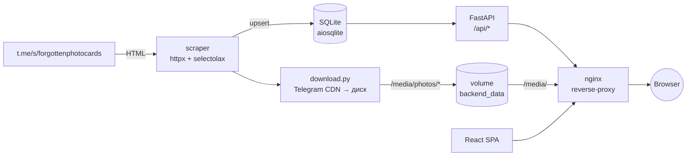

<div align="center">


# Forgotten Photocards

**Сайт Telegram‑канала [@forgottenphotocards](https://t.me/forgottenphotocards)** — backend на FastAPI сам тащит посты и фотографии из публичной превью‑страницы канала, фронт — статический React‑SPA.

[](https://www.python.org/)
[](https://fastapi.tiangolo.com/)
[](https://react.dev/)
[](https://www.sqlite.org/)
[](https://docs.docker.com/compose/)
[](https://github.com/astral-sh/uv)
[](https://t.me/forgottenphotocards)

</div>

---

## ✨ Возможности

- 🤖 **Автоматический скрейпинг** канала каждый день через APScheduler — без Telegram API, по публичной `/s/<channel>` странице.
- 🖼️ **Локальное зеркало** всех фотографий: качаются с Telegram CDN один раз и раздаются с диска.
- 📷 **Парсинг meta‑строк** из подписей: камера, объектив, плёнка, локация, модели.
- ⚡ **Async‑стек** на всех слоях: `httpx`, SQLAlchemy 2 + `aiosqlite`, FastAPI.
- 🎨 **React‑SPA без npm в проде** — JSX собирается esbuild’ом на этапе билда контейнера.
- 🐳 **One‑command deploy** — `docker compose up` для dev, оверлей под TLS для прода.

## 🧱 Стек

| Слой | Технологии |
| --- | --- |
| **Backend**  | Python 3.13 · FastAPI · SQLAlchemy 2 (async) · `aiosqlite` · APScheduler · `uv` |
| **Scraper**  | `httpx` (HTTP/2) · `selectolax` |
| **Frontend** | React 18 как `<script>`‑бандл · JSX → esbuild на этапе сборки контейнера |
| **Proxy**    | nginx перед фронтом и бэком, в проде с TLS |

## 🔭 Архитектура



## 🚀 Быстрый старт

### Dev (HTTP)

```bash
docker compose up --build
# открыть http://localhost
```

Первый запуск — БД пустая, бэк сразу стартует full‑backfill: следить за прогрессом в `docker compose logs -f backend`.

### Prod (HTTPS)

```bash
# положить сертификаты:
#   ./nginx/certs/fullchain.pem
#   ./nginx/certs/privkey.pem
docker compose -f docker-compose.yml -f docker-compose.prod.yml up --build -d
```

Подробности по сертификатам и certbot — в [`nginx/README.md`](nginx/README.md).

### Локально без Docker (только backend)

```bash
uv sync
uv run uvicorn backend.app.main:app --reload --port 8000
# Swagger UI:  http://localhost:8000/docs
```

SQLite‑файл при таком запуске уйдёт в текущую папку — переопределяется через `FPC_DATABASE_URL`.

## ⚙️ Как это работает

<details>
<summary><b>1. Скрейпинг канала</b></summary>

`backend/app/scraper/tme.py` тянет `https://t.me/s/forgottenphotocards` обычным HTTP‑GET, парсит HTML через `selectolax` и достаёт из каждой карточки:

- id поста, заголовок и описание (с разбором meta‑строк вида `Ph: #Canon_EOS_650D`, `Lens: …`, `Film: …`, `Models: …`),
- дату/время, число просмотров, реакции,
- URL‑ы фотографий из CSS `background-image: url(...)` каждого `.tgme_widget_message_photo_wrap`.

`sync.py` оркестрирует процесс:

- `sync_channel(full=False)` — одна страница (свежие посты), вызывается планировщиком каждый день.
- `sync_channel(full=True)` — пагинация назад через `?before=<msg_id>` пока не закончатся посты. Используется при первом запуске на пустой БД.

`download.py` качает фото с Telegram CDN и кладёт в `/srv/backend/data/media/photos/<post_id>/<position>.jpg`. Файлы кэшируются — повторно не скачиваются.

> **Ограничение по разрешению.** Картинки на публичной `/s/` странице — превью‑размер (≤ ~1280 px по длинной стороне). Оригиналы доступны только через Telegram MTProto API (Telethon/Pyrogram), что потребовало бы залогиненной сессии.

</details>

<details>
<summary><b>2. БД</b></summary>

SQLite, файл по умолчанию `/srv/backend/data/fpc.db` (volume `backend_data` в docker‑compose, чтобы переживало пересборки). Модели — в `backend/app/models.py`:

- **Post** — `id` (соответствует номеру сообщения в канале, не autoincrement), `title`, `type` (`film` / `digital`), `date`, `time`, `location`, `description`, `camera`, `lens`, `film`, `views`, `models`, `reactions`.
- **Photo** — `post_id` (FK), `position`, `src` (локальный `/media/...`), `tg_url` (исходный CDN URL), размеры.
- **ChannelMeta** — счётчики канала (подписчики, число фото и т.п.).

</details>

<details>
<summary><b>3. Планировщик</b></summary>

Стартует в lifespan FastAPI’я. Один cron‑job — `daily_channel_sync`, по умолчанию `0 3 * * *` UTC. Параллельно, если БД пустая, запускается фоновый full‑backfill — приложение не блокируется на старте.

</details>

<details>
<summary><b>4. Раздача статики и /media</b></summary>

В компоузе три сервиса: `backend`, `frontend` и `nginx` (внешний). nginx:

- `/api/` → `backend:8000`,
- `/media/` → файлы прямо с тома `backend_data:ro` (`alias /srv/backend/data/media/`), не идёт через FastAPI,
- `/` (всё остальное) → `frontend:80` (внутренний nginx с собранной SPA).

Браузер ходит на один origin (`http://<host>/`). CORS включается только если задан `FPC_CORS_ORIGINS` — для прод/dev в одной сети не нужен.

</details>

## 🔧 Переменные окружения

Все — необязательные, у каждой есть дефолт.

| Переменная               | Дефолт                                                   | Что делает                                                |
| ------------------------ | -------------------------------------------------------- | --------------------------------------------------------- |
| `FPC_TG_CHANNEL`         | `forgottenphotocards`                                    | Имя канала для скрейпинга (`https://t.me/s/<channel>`).   |
| `FPC_DATABASE_URL`       | `sqlite+aiosqlite:////srv/backend/data/fpc.db`           | DSN для SQLAlchemy. Можно подменить на Postgres.          |
| `FPC_SYNC_CRON`          | `0 3 * * *`                                              | Cron‑выражение (UTC) ежедневного инкрементального sync’а. |
| `FPC_LOG_LEVEL`          | `INFO`                                                   | Уровень для `logging.basicConfig`.                        |
| `FPC_CORS_ORIGINS`       | *(пусто)*                                                | Список origin’ов через запятую. Если пусто — CORS не подключается.  |
| `FPC_SCRAPER_USER_AGENT` | *(встроенный Chrome‑UA)*                                 | Кастомный User‑Agent для скрейпера, если нужно.           |

## 🌐 API

Все ручки — `GET`, JSON, no‑auth. CORS отключён по умолчанию.

| Метод                            | Что возвращает                                                    |
| -------------------------------- | ----------------------------------------------------------------- |
| `GET /api/health`                | `{"status": "ok"}` — для docker healthcheck.                      |
| `GET /api/channel`               | Метаданные канала (название, описание, счётчики, число подписчиков). |
| `GET /api/about`                 | Bio автора из `backend/app/author.json`.                          |
| `GET /api/posts`                 | Список постов, сортировка по `date desc, id desc`.                |
| `GET /api/posts/{id}`            | Один пост или 404.                                                |

Полные схемы ответов — в `backend/app/schemas.py`, либо открыть Swagger на `/docs`.

## 💻 Фронт

Открывается на корне (`/`). Маршруты:

- `/` — лента, `/film`, `/digital` — фильтры,
- `/post/<id>` — страница поста,
- `/about` — о проекте.

SPA‑роутинг через `history.pushState`; nginx (внутренний фронта и внешний reverse‑proxy) отдают `index.html` как fallback для любых path’ов, чтобы прямые ссылки работали.

**Tweaks‑панель.** В коде есть `frontend/tweaks-panel.jsx` — это внутренний дев‑инструмент, который показывается только при сообщении `__activate_edit_mode` от родительского окна (используется в редакторском canvas’е). Для конечного пользователя сайта она невидима. Через `TWEAK_DEFAULTS` в `frontend/src/app.jsx` задаются дефолтные значения тех настроек, которые иначе можно было бы переключить из панели:

```js
const TWEAK_DEFAULTS = {
  "typography": "grotesk",     // grotesk | geist | manrope
  "carousel":   "vertical"     // arrows | dots | vertical | grid
};
```

## 🗂️ Структура проекта

<details>
<summary>Развернуть дерево</summary>

```
.
├── backend/
│   ├── app/
│   │   ├── main.py            FastAPI app + lifespan + APScheduler (cron daily sync)
│   │   ├── db.py              async engine + SessionLocal + init_db
│   │   ├── models.py          Post, Photo, ChannelMeta (SQLAlchemy)
│   │   ├── schemas.py         Pydantic-схемы ответа API
│   │   ├── seed.py            ручной seed из seed_posts.json (опц.)
│   │   ├── seed_posts.json    стартовый набор постов (если не из канала)
│   │   ├── author.json        bio автора для /api/about
│   │   └── scraper/
│   │       ├── tme.py         HTTP-клиент + парсер /s/-страниц канала
│   │       ├── download.py    скачивание фото-CDN URL → /media/photos/<id>/<pos>.jpg
│   │       └── sync.py        оркестратор: parse → upsert → download
│   └── Dockerfile             uv-builder → slim python runtime
│
├── frontend/
│   ├── index.html             точка входа SPA (грузит /api/posts перед mount)
│   ├── src/
│   │   ├── api.js             window.loadPosts/loadChannel/loadAuthor
│   │   ├── boot.jsx           bootstrap: грузит данные, рендерит App
│   │   ├── app.jsx            router + App shell + AboutPage + 404
│   │   ├── feed.jsx           страница ленты
│   │   ├── post.jsx           страница поста
│   │   ├── carousel.jsx       4 варианта показа фото (arrows / dots / vertical / grid)
│   │   ├── components.jsx     Header / Footer / PostCard / MobileMenu
│   │   └── styles-*.css       base / feed / post / carousel / about
│   ├── tweaks-panel.jsx       дев-панель (в проде скрыта)
│   ├── nginx.conf             внутренний nginx сервиса frontend (раздаёт статику)
│   └── Dockerfile             esbuild → nginx:1.27-alpine
│
├── nginx/                     внешний reverse-proxy
│   ├── dev.conf               :80, plain HTTP
│   ├── prod.conf              :80 → 301 HTTPS, :443 TLS
│   ├── Dockerfile.dev / Dockerfile.prod
│   ├── certs/                 сюда кладутся fullchain.pem + privkey.pem для прода
│   └── README.md              инструкции по сертификатам
│
├── docker-compose.yml         dev-стек (HTTP)
├── docker-compose.prod.yml    оверлей под TLS
├── pyproject.toml / uv.lock   зависимости backend
└── export/                    самостоятельная (legacy) сборка фронта — игнорируйте
                               в обычном режиме разработки
```

</details>

---

<div align="center">

Сделано с любовью к плёнке и забытым кадрам · [t.me/forgottenphotocards](https://t.me/forgottenphotocards)

</div>
